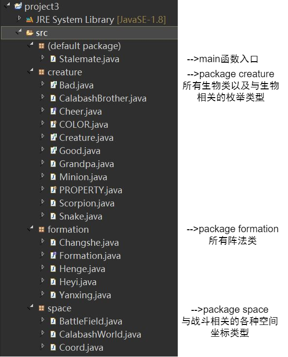
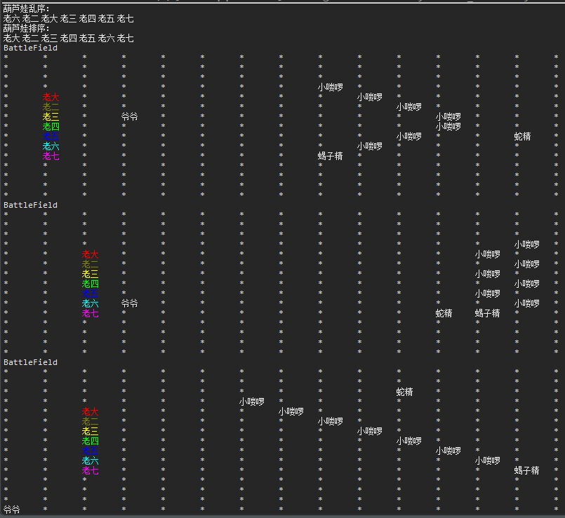

# 实验报告

## 文件结构
本次实验采取 **一个类型一个java文件** 的设计方法，所以文件众多。为了方便项目管理与视图的清晰，将项目划分为几个包，将相关文件放入相关包中。具体结构如下图所示：

## 类图

## 设计思想
- 老师上课说过，在main函数中首先要做的是完成 **创世界** 的任务，所以我设计了CalabashWorld这个类，在葫芦世界里，有各种各样的生物、有战斗场所、有让世界运转的各种方法（即战斗过程）。CalabashWorld类的成员变量即为葫芦娃、爷爷、蛇精、蝎子精、小喽啰以及战斗场所；成员函数有葫芦娃的乱序、排序、葫芦娃按指定阵型投放、蝎子精和小喽啰按指定阵型投放、输出对峙局面等等。在CalabashWorld的构造函数中完成成员变量的初始化过程，在main函数中首先new一个CalabashWorld类，然后通过调用类的成员函数来推进战斗过程。
- 关于`抽象类、普通类、接口`的认识和在本次实验中的选择
1. 抽象类与普通类
    所谓抽象，就是一种只存在于概念而非具体的类型，也正是因为此抽象类不能被实例化。打比方说，人、男人、女人，其中人应该被设置为抽象类，男人和女人继承自人。因为只要一个实体是“人”，他必定是“男人”或“女人”中的一种，他不能不属于男人或女人而单独作为一个没有性别的“人”存在，所以抽象类“人”是不能被实例化的。根据这个认识，在本次实验中，Creature是所有生物类型的基类，它是一个抽象类，Good和Bad继承自Creature，也是抽象类，代表好人和坏人。CalabashBrother葫芦兄弟和Grandpa爷爷继承自Good（枚举类不能继承，所以葫芦娃类不再使用枚举类型），Snake蛇精,Scorption蝎子精和Minion小喽啰继承自Bad。
2. 抽象类和接口
    > 抽象类是对本质的抽象，接口是对动作的抽象。

    抽象类表示这个类是什么，而接口表示这个类能做什么。接口使得不同的类有相同的操作，又可以在不同类中去重写这个方法。由此，爷爷和蛇精都具有加油助威的能力，所以他们都应该继承一个Cheerable的接口，接口中有Cheer方法，并在各自类中重写这个Cheer方法（虽然现在还没有实际作用）。对于所有的阵法，我将其抽象为Formation接口，接口中声明了conjure函数，表示施法；其余所有的阵法类都继承自Formation接口，并在类中覆写conjure函数，排出不同阵型。

## 面向对象相关概念
1. 聚合

    聚合是一种has-a的关系，但不是must have的关系，拥有类与被拥有类的生命周期可以不同。如CalabashWorld类由BattleField、CalabashBrother、Grandpa、Snake、Scorption、Minion组成，但CalabashWorld脱离了其中任意一个类仍然有意义。
2. 组合
    组合也是一种has-a的关系，且是must have的关系，也称强聚合。整体与部分是不可分的，整体的生命周期结束也就意味着部分的生命周期结束。如BattleField类由Coord类组成，如果没有战斗场，战斗场上的坐标点就没有意义了。其实聚合和组合在代码中的表现形式相同，只是语义上的差别。
3. 继承
    从已有类型中产生新类，新类包含已有类型的所有方法，并可以为自己添加新的方法。如Good和Bad继承自Creature，CalabashBrother和Grandpa继承自Good，Snake、Scorption、Minion继承自Bad。
4. 接口
    接口是方法的抽象。接口中没有属性，只有方法声明，没有实现。如接口Cheerable代表具有加油助威的能力，而Grandpa和Snake具有这个能力，便继承自这个接口，并必须在各自类中实现接口中的方法。
5. 抽象类
    抽象类是类本质的抽象。抽象类不能被实例化，但抽象类中可以有属性和方法，其中抽象方法必须在子类中实现。如Creature是一个抽象类，其中有一个抽象方法getProperty获取生物的属性（好或坏），在子类Good和Bad中完成了实现。
6. 多态
    多态是同一个行为具有多个不同表现形式或形态的能力。就是同一个接口，使用不同的实例而执行不同操作。在BattleField类中override了toString操作，打印对峙局面时可以直接使用System.out.Println(BattleField)。

## 运行效果展示
