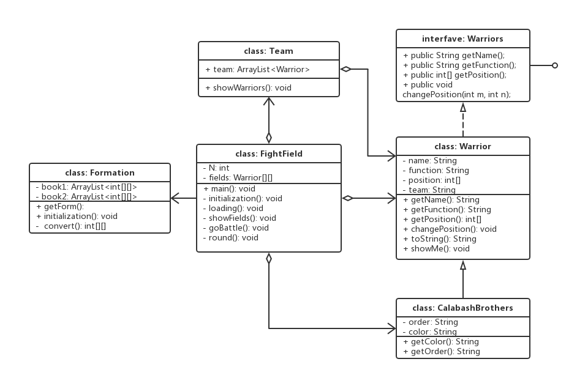
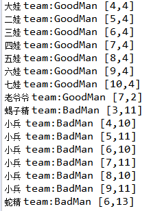

# README

## copyright@why | version 3.1 | date 2018-11-13

## https://github.com/cjnjuwhy

>更新内容：
>
>更新建议：
>
>version6.0:使用网络对代码进行改写
>
>version7.0:使用图形化界面改写代码，实现图形化的展示
>
>version8.0:使用注解，测试对代码进一步地完善
>
>version5.1:
>
>> 增加了对象状态的调取，以及对象的保存，用于加载对象以及保存对象内容。
>
>version5.0:
>
>> 增加了文件的写入，通过formation.txt来读取Formation内的数据，以便方便地添加和删除阵型信息
>>
>> 增加了文件的输出，将每次模拟的结果输出到FightField.txt文件中。
>
>Version4.0:
>
>> 增加了排序操作，针对不同的队伍，完成了排序操作
>>
>> 使用范型完善了代码，并且在运行时对类型进行了检查
>
>version 3.1:
>
>> 完善了代码的结构，给类酌情增加了Interface，便于对类功能的控制
>>
>> 增加了乱序操作，使得Warrior在队伍中的顺序相较于进入时是混乱的
>
>version 3.0:
>
>>  添加了几处异常处理机制，使得程序更加稳定。
>>
>> 自定义了一个新的异常，及时发现并且“归化”异类，保证了在同一组中不会出现“间谍”存在；对类重新进行组织，使得相互之间的通讯只能通过接口而不能直接作用数据； 利用collection来完成了葫芦娃程序。


##### 1. 所包含的文件

```java
FightField.java

MyException.java
CalabashBrothers.java
CalabashBrothersEnum.java // undo

Team.java
TeamInterface.java

Warriors.java
Warrior.java
WarriorInterface.java

Formation.java
FormationInterface.java

FightField_MMDD.txt	// 用于保存场面信息，并且能够保存多次的内容
formation.txt		// 用于保存队形信息
GoodMan.txt			// 
BadMan.txt			// 用于保存团队信息，在程序中加载对象
Warriors_MMDD.dat	// 将最后的对象保存在文件中，以便保存战斗过程
```

##### 2. 编写思路

在一个新世界里，有一个创世主（我），有一天他突发奇想，准备模拟当年葫芦娃大战妖精的场面，于是他便开始了他的创作。

1. 首先得有战斗人员，为了规范战斗人员的行为，为此创建一个Worriors接口，规定了战斗人员需要拥有的对外方法。然后在这个基础上定义一个类——Warrior，这便是战士的原型。葫芦娃有着更多的特征，所以以Warrior为基类，派生出CalabashBrothers。
2. 其次得有战斗的队伍，Team类实现这样的功能，将所有出场的任务分为两边：teamGood和teamBad，直接将登陆的战士按派别放入其中。
3. 再者需要有战斗时的阵法，Formation类存储着多种阵法，可以通过输入选择。
4. 最后需要有战场FightField类中创造出这样的对象，可以实现战士的登录、分组，上场等。战场上的每个位置都是一个Warrior对象的引用，同时每个Warrior对象中也保存着自己在战场上的位置。

整个的流程是：

1. 创建战场，创建两只队伍，创建阵法书
2. 初始化战场；创建两队的战斗人员，将其装载到两支队伍中
3. 战斗前确认，显示两队的成员
4. 根据输入选择相应的阵法
5. 根据两队的阵法，分别将两支队伍加入到战场中，并打印战场内容
6. 中场休息，清空战场，两队退下
7. 重新选择妖精队的阵法，将两支队伍再次加入到战场中，打印战场内容
8. 打印当前各队成员的完整信息

#### 3. UML图




#### 4. 类的实现

```java
FightField.java
/*
*@see class FightField, class Formation, class Team
**/
class FightField{
//Variables
	private static final int N = 15;
	private warrior[][] fields;
//Methods
	public static void main();
	private void initialization();
	private static void loading(ArrayList<Warrior>, ArrayList<Warrior>);
	private void showFields();
	private void goBattle(ArrayList<Warrior>, int[][]);
	private void round(Team, Team, Scanner);
}

class Team{
//Variables
	public ArrayList<Warrior> team;
//Methods
	public void showWarriors()
}

class Formation{
//Variables
	private static ArrayList<int[][]> book1;
	private static ArrayList<int[][]> book2;
//Methods
	public static void initialization();
	public static int[][] getForm(int, int);
	private static int[][] convert(int[][]);
}
```

```java
Warriors.java
/*
*@see interface Warriors
**/
interface Warriors{
//Methods
	public String getName();
	public String getFunction();
	public int[] getPosition();
	public void changePosition(int m, int n);
}
```

```java
Warrior.java
/*
*@see class Warrior
**/
class Warrior interface Warriors{
//Variables
	private String name;
	private String function;
	private int[] position;
	private String team;
//Methods
	public String getName();
	public String getFunction();
	public int[] getPosition();
	public void changePosition(int, int);
	public String toString();
	public void showMe();
}
```

```java
CalabashBrothers.java
/*
*still building...
*@see class CalabashBrothers
**/
public class CalabashBrothers extends Warrior{
//Variables
	//private String color;
	//private int order;
//Methods
	//public String getColor();
	//public int getOrder();
}
```


#### 5. 执行过程



