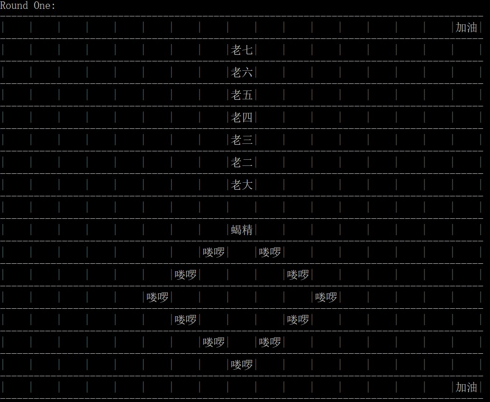
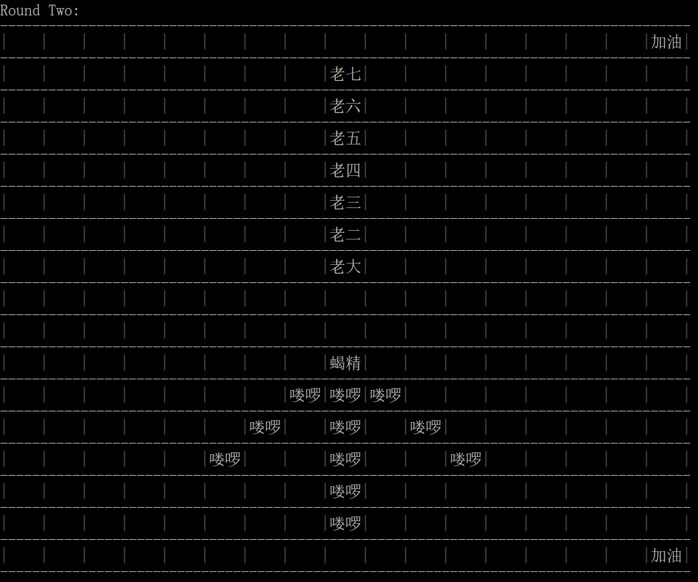

# Java Homework 3
## 2018.11.06更新(Position类)
- 添加了Position类，表示BattleField上的一个位置。一个Position中存放一个Creature，而一个BattleField中存放一个Position矩阵。相比直接在BattleField中存放Creature矩阵，这样修改更符合逻辑。
- 同时，将打印BattleField时具体显示内容（cheer、name或空白）的判断逻辑放到Position类中，更好地实现了封装。
***
## 2018.11.06更新(Collection)
- 使用Collection框架修改了程序中保存Creature的方式，简化了代码。比如，交换两个元素可以写为：
```java
if (mans.get(j).getSeq() > mans.get(j + 1).getSeq()) {
    // Exchange
    Collections.swap(mans, j, j + 1);
}
```
生成随机葫芦娃List，可以写为：
```java
public static List<CalabashMan> getRandomCalabashMans() {
    // Do someting
    Collections.shuffle(calabashMans);
    // Do something
}
```
***

## 运行
测试环境：JavaSE-10
```bash
> cd src
> javac ./BattleTest.java ./com/cjinchi/battlefield/*.java ./com/cjinchi/creature/*.java ./com/cjinchi/util/*.java
> java BattleTest
```

## 设计思路
- 实现一个生物类Creature，该类体现了生物体所共有的属性和方法，之后创建的其他生物体都从该类继承。
- 由于在实际中，“爷爷”、“蝎精”和“蛇精”等是单一的实体，如果直接作为一个类处理可能会被用户创建出多个实体，与实际相违背。因此，这些类使用“单例模式”设计，将其构造方法设为私有，另外添加一个getInstance()方法用于获取对象，保证每次获取到同一对象。对于“葫芦娃”、“喽啰”等类，也采用了类似的方法，通过getInstance(int index)中的参数index确定返回哪一个对象。
```java
    private static GrandFather grandFather;

    private GrandFather() {
        //Do something
    }

    public static GrandFather getInstance() {
        if (grandFather == null) {
            grandFather = new GrandFather();
        }
        return grandFather;
    }
```
- 实现了接口Cheerful，接口中有方法cheer()表示欢呼加油的技能，在本例中“爷爷”、“蛇精”两人实现了这一接口。
在打印战场局势时，会对战场上每个生物动态地判断是否“instanceof Cheerful”，如果不是则简单地打印出名字，表示生物体在这里；如果是则调用它们的cheer()方法进行欢呼[目前只是简单地打印“加油”二字，后续可以拓展功能]。
```java
    if (field[i / 2][j / 2] == null) {
        //Do something
    } else if (field[i / 2][j / 2] instanceof Cheerful) {
        Cheerful cheerer = (Cheerful) field[i / 2][j / 2];
        cheerer.cheer();
    } else {
        System.out.print(field[i / 2][j / 2].getName());
    }
```
- “葫芦娃”类还另外实现了static方法getRandomCalabashMans()和sortBySequence(CalabashMan[] brothers)，分别用于获取乱序的葫芦娃兄弟数组，及对特定葫芦娃数组排序。这些函数封装了比较常见的操作，简化了对该类的使用。
- “战场”类用于维护战场的相关信息，在本实验中用一个二维数组Creature[][]保存战场上的生物体信息。同时，战场类还实现一系列”set/remove + xxx side + xxx format”函数，表示“在战场的某一个位置，用某些生物体实现xxx阵型”或“移除战场某个位置的xxx阵型”，方便对生物体进行阵型的排布。
```java
public void setSideOneChangsheFormat(Creature[] creatures);
public void setSideTwoFangyuanFormat(Creature[] creatures);
public void setSideOneAudience(Creature creature);

public void removeSideOneChangsheFormat();
//...
```

## 运行结果

